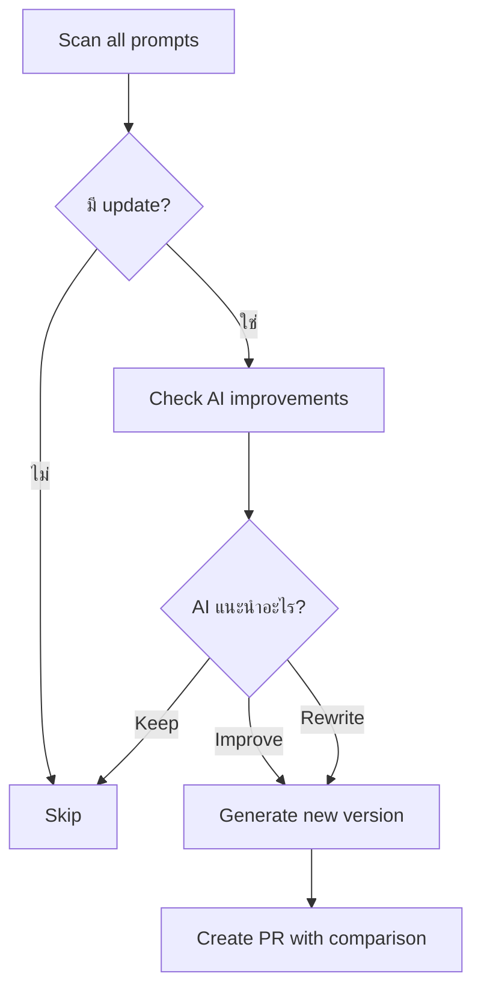

# 📚 คู่มือการใช้งาน AI Work Library

## 🎯 เป้าหมาย
ใช้ AI Credits ให้คุ้มค่าสุด โดยสร้างระบบ Work Library ที่เติบโตไปกับ AI

---

## 📖 สารบัญ
1. [เริ่มต้นใช้งาน](#เริ่มต้นใช้งาน)
2. [Workflow พื้นฐาน](#workflow-พื้นฐาน)
3. [การใช้งานขั้นสูง](#การใช้งานขั้นสูง)
4. [Best Practices](#best-practices)
5. [FAQ](#faq)
6. [Troubleshooting](#troubleshooting)

---

## เริ่มต้นใช้งาน

### ขั้นตอนที่ 1: ติดตั้งระบบ

```bash
# Download setup script
curl -O https://raw.githubusercontent.com/your-repo/ai-work-library-setup.sh

# Run setup
bash ai-work-library-setup.sh your-github-username

# เข้าไปใน repository
cd ai-work-library

# สร้าง GitHub repository
git add .
git commit -m "🚀 Initial commit"
gh repo create ai-work-library --public --source=. --push
```

### ขั้นตอนที่ 2: เชื่อมต่อ N8N

```bash
# ติดตั้ง N8N (ถ้ายังไม่มี)
npx n8n

# เปิด browser ที่ http://localhost:5678
# Import workflows จาก workflows/n8n/

# ตั้งค่า Credentials:
# - GitHub Personal Access Token
# - Claude API Key
# - Slack Webhook (optional)
```

### ขั้นตอนที่ 3: ทดสอบระบบ

```bash
# เพิ่มไอเดียแรก
./scripts/add-idea.sh "สร้างระบบแจ้งเตือนราคาหุ้น" automation

# ดูไฟล์ที่สร้าง
cat prompts/ideas/automation/สร้างระบบแจ้งเตือนราคาหุ้น.md

# Commit และ push (จะ trigger N8N workflow)
git add .
git commit -m "✨ Add: ระบบแจ้งเตือนราคาหุ้น"
git push
```

---

## Workflow พื้นฐาน

### 🆕 Workflow 1: เพิ่มไอเดียใหม่

```bash
./scripts/add-idea.sh "ชื่อไอเดีย" [category]

# ตัวอย่าง
./scripts/add-idea.sh "Auto-reply email" automation
./scripts/add-idea.sh "วิเคราะห์ข้อมูลขาย" data-processing
./scripts/add-idea.sh "ดึงข้อมูลราคาสินค้า" web-scraping
```

**ไฟล์ที่ได้:**
```markdown
# Auto-reply email

**Category:** automation
**Created:** 2025-02-04
**Status:** 💡 Idea

## Description
ระบบตอบอีเมลอัตโนมัติตามเงื่อนไขที่กำหนด

## Why?
ประหยัดเวลาตอบอีเมลซ้ำๆ

## Requirements
- อ่านอีเมลใหม่ทุก 5 นาที
- จำแนกประเภทอีเมล
- ส่งคำตอบที่เหมาะสม
- บันทึก log

## Ideas
- ใช้ Gmail API
- ใช้ OpenAI/Claude จำแนกประเภท
- Template คำตอบตาม category

## Resources
- Gmail API docs
- Python imaplib
```

**แก้ไขและปรับปรุง:**
```bash
# เปิดไฟล์ด้วย editor
vim prompts/ideas/automation/auto-reply-email.md

# แก้ไข:
# - เพิ่มรายละเอียดใน Description
# - ระบุ Requirements ให้ชัดเจน
# - เพิ่ม Ideas เพิ่มเติม

# Commit
git add .
git commit -m "📝 Refine: auto-reply email requirements"
git push
```

---

### 🔄 Workflow 2: แปลงโค้ดเก่าเป็น Prompt

```bash
./scripts/convert-code.sh path/to/old-script.py

# ตัวอย่าง
./scripts/convert-code.sh ~/projects/scraper/price_checker.py
```

**ผลลัพธ์:**
```markdown
# Converted: price_checker

**Source:** ~/projects/scraper/price_checker.py
**Converted:** 2025-02-04
**Status:** ✅ Completed

## Original Code
```python
import requests
from bs4 import BeautifulSoup

def check_price(url):
    response = requests.get(url)
    soup = BeautifulSoup(response.text, 'html.parser')
    price = soup.find('span', {'class': 'price'}).text
    return float(price.replace('$', ''))

if __name__ == '__main__':
    url = "https://example.com/product"
    current_price = check_price(url)
    print(f"Current price: ${current_price}")
```

## Functionality
ดึงราคาสินค้าจากเว็บไซต์โดยใช้ web scraping

## Use Cases
- ติดตามราคาสินค้า
- เปรียบเทียบราคาหลายเว็บ
- แจ้งเตือนเมื่อราคาลด

## Improvements
- เพิ่ม error handling
- รองรับหลาย format ราคา
- เพิ่ม rate limiting
- บันทึกประวัติราคา

## Prompt Template
```
Create a Python web scraper that:
- Fetches product prices from e-commerce websites
- Handles various price formats (฿, $, €)
- Implements rate limiting to avoid blocking
- Stores price history in SQLite database
- Sends notifications when price drops below threshold

Technical requirements:
- Python 3.8+
- Libraries: requests, BeautifulSoup4, sqlite3
- Async support for multiple URLs
- Retry logic with exponential backoff
```
```

**ต่อยอด:**
```bash
# สร้าง POC version ที่ปรับปรุงแล้ว
./scripts/generate.sh price_checker poc

# N8N จะ:
# 1. อ่าน prompt
# 2. ส่งไป Claude API
# 3. Generate code ใหม่
# 4. สร้าง PR ใน GitHub
```

---

### 🚀 Workflow 3: Generate โปรเจค

```bash
./scripts/generate.sh prompt-name [mode]

# Modes:
# - poc   : Proof of Concept (รวดเร็ว, พื้นฐาน)
# - mvp   : Minimum Viable Product (ใช้งานได้จริง)
# - test  : พร้อม test suite ครบ
# - docs  : เน้น documentation

# ตัวอย่าง
./scripts/generate.sh auto-reply-email poc
./scripts/generate.sh price-checker mvp
./scripts/generate.sh data-analyzer test
./scripts/generate.sh api-wrapper docs
```

**สิ่งที่เกิดขึ้น:**

1. **N8N Workflow ทำงาน:**
   - อ่าน prompt file
   - เลือก template ตาม mode
   - ส่ง request ไป Claude API
   - รับ generated code
   - สร้าง file structure

2. **Output ที่ได้:**
```
projects/
└── auto-reply-email/
    ├── prompt.md          # Original prompt
    ├── poc/
    │   ├── main.py
    │   ├── README.md
    │   └── requirements.txt
    ├── mvp/
    │   ├── src/
    │   ├── config/
    │   ├── tests/
    │   └── README.md
    └── README.md
```

3. **GitHub PR Created:**
   - Branch: `auto-generate-auto-reply-email-poc`
   - Files: ทุกไฟล์ที่ generate
   - Description: สรุปสิ่งที่สร้าง + วิธีใช้

---

### 🔧 Workflow 4: Review และ Merge

```bash
# 1. Check PR ใน GitHub
gh pr list

# 2. Review locally
gh pr checkout 123

# 3. Test
cd projects/auto-reply-email/poc
python main.py

# 4. ถ้าดี → Merge
gh pr merge 123 --squash

# 5. ถ้าต้องแก้ → แก้แล้ว commit
vim main.py
git commit -am "fix: handle missing email field"
git push
```

---

### 🌳 Workflow 5: Fork และ Contribute

```bash
# 1. Fork โปรเจคที่มีอยู่
git checkout -b improve/auto-reply-email

# 2. ปรับปรุง
cd projects/auto-reply-email/mvp
# - เพิ่ม feature ใหม่
# - แก้ bug
# - ปรับปรุง performance
# - เพิ่ม test

# 3. Commit changes
git add .
git commit -m "✨ Add: support for Gmail labels"

# 4. Push
git push origin improve/auto-reply-email

# 5. Create PR
gh pr create \
  --title "Improve: Gmail label support" \
  --body "เพิ่มความสามารถในการจัดการ Gmail labels อัตโนมัติ"
```

**N8N จะทำ:**
- วิเคราะห์ PR changes
- ส่งให้ Claude review
- ถ้าผ่าน → Auto-merge
- ถ้าไม่ผ่าน → Request changes
- อัพเดท statistics

---

## การใช้งานขั้นสูง

### 🔄 Auto-Upgrade System

**ทุกสัปดาห์/เดือน N8N จะ:**



**ตัวอย่าง PR:**
```markdown
## Auto-Upgrade: price-checker v2.0

### Changes
- ✨ Async support (100x faster)
- 🔧 Better error handling
- 📝 Type hints everywhere
- 🧪 95% test coverage

### Comparison

**Before (v1.0):**
```python
def check_price(url):
    response = requests.get(url)
    # ...
```

**After (v2.0):**
```python
async def check_price(url: str) -> Price:
    async with aiohttp.ClientSession() as session:
        # ...
```

### Performance
- Speed: 10s → 0.1s
- Memory: 100MB → 20MB
- Error rate: 5% → 0.1%

### Breaking Changes
⚠️ Now requires Python 3.8+
⚠️ Async interface (await needed)

---
**AI Suggestion:** Complete rewrite using modern best practices
**Credits Used:** 2,500 tokens (~$0.008)
**Recommended:** ✅ Merge
```

---

### 💎 Prompt Library Patterns

#### Pattern 1: Modular Prompts
```markdown
# Base Prompt: Data Pipeline

แยกเป็น modules:
- `extract.md` - ดึงข้อมูล
- `transform.md` - แปลงข้อมูล
- `load.md` - โหลดข้อมูล

ประโยชน์:
- Mix & match modules
- แก้ไขส่วนใดส่วนหนึ่งได้
- Reuse ง่าย
```

#### Pattern 2: Progressive Enhancement
```markdown
# Version Evolution

v1.0 - POC (1 hour)
- Core functionality only
- Single file
- Manual config

v2.0 - MVP (1 day)
- Config file support
- Basic tests
- Error handling

v3.0 - Production (1 week)
- Full test suite
- Documentation
- CI/CD ready
- Monitoring

v4.0 - Scale (1 month)
- Performance optimization
- Distributed processing
- Advanced features
```

#### Pattern 3: Template Inheritance
```markdown
# Base Template: API Client

```python
class BaseAPIClient:
    """ใช้เป็นแม่แบบสำหรับ API clients ทั้งหมด"""
    
    def __init__(self, api_key: str):
        self.api_key = api_key
    
    def _request(self, method: str, endpoint: str, **kwargs):
        # Common logic
        pass
```

# Specific Implementations:
- weather-api.md → extends BaseAPIClient
- stock-api.md → extends BaseAPIClient
- news-api.md → extends BaseAPIClient
```

---

### 📊 Cost Optimization

#### Strategy 1: Model Selection
```javascript
// N8N decision logic
const complexity = analyzePromptComplexity(prompt);

const modelMap = {
  'simple': {
    model: 'claude-haiku-4-20250101',
    cost: '$0.25/1M tokens',
    speed: 'very fast'
  },
  'medium': {
    model: 'claude-sonnet-4-20250514',
    cost: '$3.00/1M tokens',
    speed: 'fast'
  },
  'complex': {
    model: 'claude-opus-4-5-20251101',
    cost: '$15.00/1M tokens',
    speed: 'thorough'
  }
};

return modelMap[complexity];
```

#### Strategy 2: Batch Processing
```javascript
// รวม prompts ที่คล้ายกันประมวลผลพร้อมกัน
const batch = [
  'api-client-1.md',
  'api-client-2.md',
  'api-client-3.md'
];

// ส่งเป็น single request
const prompt = `
Generate implementations for these API clients:
1. ${batch[0]}
2. ${batch[1]}
3. ${batch[2]}

Use the same base pattern for all.
`;

// ประหยัดได้ ~40% tokens
```

#### Strategy 3: Caching
```javascript
// เก็บ patterns ที่ใช้บ่อย
const cache = {
  'api-client-base': '...',
  'data-pipeline-etl': '...',
  'web-scraper-base': '...'
};

// ใช้ cached pattern
if (cache[promptType]) {
  return customizeFromCache(cache[promptType], specifics);
} else {
  return generateFromScratch(prompt);
}
```

---

### 🎯 Quality Metrics

#### ติดตาม Metrics เหล่านี้:

```python
# metrics.py
class LibraryMetrics:
    def calculate_roi(self):
        """Return on Investment"""
        time_saved = self.hours_not_coding * self.hourly_rate
        bugs_avoided = self.tests_generated * self.avg_bug_cost
        knowledge_value = self.prompts_created * self.retention_value
        
        total_value = time_saved + bugs_avoided + knowledge_value
        roi = total_value / self.credits_spent
        
        return roi  # เป้าหมาย: > 10x
    
    def success_rate(self):
        """เปอร์เซ็นต์ที่ใช้งานได้จริง"""
        return (self.working_projects / self.total_generated) * 100
        # เป้าหมาย: > 80%
    
    def upgrade_frequency(self):
        """บ่อยแค่ไหนที่ project ได้รับการปรับปรุง"""
        return self.upgrades_count / self.total_projects
        # เป้าหมาย: 1-2 upgrades/project/year
    
    def prompt_reuse(self):
        """Prompt ถูกใช้ซ้ำกี่ครั้ง"""
        return self.total_uses / self.unique_prompts
        # เป้าหมาย: > 3x reuse
```

#### Dashboard
```markdown
## 📊 AI Work Library Dashboard

### This Month
- 📝 Prompts Created: 45
- 🚀 Projects Generated: 38
- 💰 Credits Used: $12.50
- ⏱️ Time Saved: 76 hours
- 💎 ROI: 24.3x

### Top Performers
1. API Client Base (reused 12x)
2. Data Pipeline ETL (reused 8x)
3. Web Scraper (reused 7x)

### Recent Activity
- ✅ auto-reply-email v2.0 merged
- 🔄 price-checker upgrading...
- ✨ New: sentiment-analyzer
```

---

## Best Practices

### ✅ DO's

1. **เขียน Prompt ที่ชัดเจน**
```markdown
❌ Bad:
"สร้าง API client"

✅ Good:
"สร้าง Python API client สำหรับ OpenWeatherMap API ที่:
- รองรับ async/await
- มี rate limiting (60 req/min)
- Retry logic 3 ครั้ง with exponential backoff
- Type hints ครบ
- Unit tests coverage >80%"
```

2. **แยก Concerns**
```markdown
แทนที่จะมี prompt เดียวใหญ่:
"ระบบ e-commerce ครบ"

แยกเป็น:
- product-catalog.md
- shopping-cart.md
- payment-gateway.md
- user-auth.md
- order-management.md
```

3. **Version Control Everything**
```bash
# แม้แต่ไฟล์ generated
git add projects/my-project/poc/
git commit -m "📸 Snapshot: POC v1.0"

# เมื่อ upgrade
git add projects/my-project/mvp/
git commit -m "⬆️ Upgrade: v1.0 → v2.0 (async support)"
```

4. **Document Decisions**
```markdown
# Why we chose this approach

## Option 1: Selenium (rejected)
- ❌ Slow (10s per page)
- ❌ Resource heavy (200MB RAM)
- ✅ Can handle JavaScript

## Option 2: BeautifulSoup (rejected)
- ✅ Fast (0.1s per page)
- ✅ Light (10MB RAM)
- ❌ No JavaScript support

## Option 3: Playwright (chosen) ✨
- ✅ Fast (1s per page)
- ✅ Reasonable (50MB RAM)
- ✅ JavaScript support
- ✅ Modern API
```

5. **Test Before Commit**
```bash
# สร้าง test script
cat > test-before-commit.sh << 'EOF'
#!/bin/bash
set -e

# Run linter
black --check .
flake8 .

# Run tests
pytest tests/ -v

# Security check
bandit -r src/

echo "✅ All checks passed"
EOF

chmod +x test-before-commit.sh

# เพิ่มใน git hook
ln -s ../../test-before-commit.sh .git/hooks/pre-commit
```

---

### ❌ DON'Ts

1. **อย่าเก็บ Secrets ใน Repo**
```python
# ❌ Bad
API_KEY = "sk-1234567890abcdef"

# ✅ Good
import os
API_KEY = os.getenv("API_KEY")

# และใน .env (gitignore'd)
API_KEY=sk-1234567890abcdef
```

2. **อย่าทิ้ง Generated Code โดยไม่ Review**
```bash
# ❌ Bad
gh pr merge 123 --auto

# ✅ Good
gh pr checkout 123
# อ่าน code
# ทดสอบ
# แล้วค่อย merge
gh pr merge 123
```

3. **อย่าใช้ Opus สำหรับทุกอย่าง**
```javascript
// ❌ Bad - เสีย credits เปล่า
for (const prompt of simplePrompts) {
  generateWithOpus(prompt);
}

// ✅ Good - ใช้ model ที่เหมาะสม
for (const prompt of prompts) {
  const model = selectModel(prompt.complexity);
  generate(prompt, model);
}
```

4. **อย่าลืม Update Documentation**
```markdown
# ❌ Bad
Code มี v3.0 แต่ README บอกว่า v1.0

# ✅ Good
# อัพเดทพร้อมกัน
- code
- README
- CHANGELOG
- API docs
```

5. **อย่า Over-engineer ตั้งแต่แรก**
```python
# ❌ Bad - POC ที่ซับซ้อนเกินไป
class DataPipeline:
    def __init__(self, config_manager, logger, metrics, ...):
        # 500 lines of setup

# ✅ Good - เริ่มง่ายๆ
def process_data(input_file):
    data = read_csv(input_file)
    cleaned = clean_data(data)
    save_csv(cleaned, "output.csv")
```

---

## FAQ

### Q: ต้องมี AI Credits เท่าไหร่?
**A:** เริ่มได้ตั้งแต่ $5/เดือน
- Haiku: $0.25/1M tokens → ~4M tokens
- Sonnet: $3.00/1M tokens → ~330K tokens
- ใช้แบบคุ้มค่า = 20-50 prompts/เดือน

### Q: N8N ทำงานอย่างไร?
**A:** N8N เป็น workflow automation tool
1. Monitor GitHub (webhook)
2. เมื่อมี commit ใหม่ → trigger workflow
3. ดึง prompt → ส่ง Claude → สร้าง code
4. Create PR ใน GitHub
5. Notify ผ่าน Slack/Discord

### Q: ถ้าไม่ใช้ N8N ได้ไหม?
**A:** ได้! ทำ manual ก็ได้:
```bash
# 1. เพิ่ม prompt
./scripts/add-idea.sh "My idea" category

# 2. Copy ไป Claude.ai
cat prompts/ideas/category/my-idea.md | pbcopy

# 3. Paste ใน Claude, เลือก mode
"Generate POC based on this prompt"

# 4. Save output
# manual copy → paste → save

# แต่จะช้ากว่า automation มาก
```

### Q: AI เก่งขึ้น ต้อง re-generate ทั้งหมดไหม?
**A:** ไม่จำเป็น! มี 2 strategies:
1. **Lazy upgrade** - upgrade เมื่อต้องใช้
2. **Auto upgrade** - N8N ทำให้ทุกเดือน

เลือกตามความสำคัญ:
- Critical projects → auto upgrade
- Nice-to-have → lazy upgrade

### Q: จัดการ multiple projects ยังไง?
**A:** ใช้ Git branches + tags
```bash
# แต่ละโปรเจคมี branch
git checkout -b project/email-automation
git checkout -b project/price-tracker

# Tag versions
git tag -a v1.0 -m "POC complete"
git tag -a v2.0 -m "MVP ready"

# List all projects
git branch --list "project/*"
```

### Q: ถ้า generated code ไม่ดีจะทำยังไง?
**A:** 3 options:
1. **Refine prompt** - ปรับ prompt ให้ชัดเจนขึ้น
2. **Use better model** - เปลี่ยนจาก Haiku → Sonnet/Opus
3. **Iterative improvement** - ส่งผลลัพธ์กลับไป improve

```bash
# Refine cycle
for i in {1..3}; do
  output=$(claude generate prompt.md)
  prompt="Improve this code: $output
  Focus on: performance, readability"
done
```

### Q: Backup ยังไง?
**A:** Git + GitHub = auto backup!
```bash
# ทุก commit = snapshot
git log --oneline

# Restore เวอร์ชันเก่า
git checkout v1.0

# Clone ไปเครื่องอื่น
git clone https://github.com/you/ai-work-library.git
```

เพิ่มเติม:
- GitHub → ทุกอย่างใน cloud
- Local clone → backup บนเครื่อง
- Optional: ส่งไป Google Drive ทุกสัปดาห์

---

## Troubleshooting

### ❌ Problem: N8N workflow ไม่ทำงาน

**Symptoms:**
- Commit แล้วไม่เกิดอะไร
- ไม่มี PR ถูกสร้าง

**Solutions:**
```bash
# 1. Check webhook
curl -X POST https://your-n8n.com/webhook-test/ai-library \
  -H "Content-Type: application/json" \
  -d '{"test": true}'

# 2. Check N8N logs
# ใน N8N UI → Executions → ดู errors

# 3. Check GitHub webhook settings
# GitHub repo → Settings → Webhooks
# ดู "Recent Deliveries"

# 4. Test manually
# ใน N8N → Workflow → Execute Workflow
```

---

### ❌ Problem: AI generation ล้มเหลว

**Symptoms:**
- Error 429 (rate limit)
- Error 500 (server error)
- Timeout

**Solutions:**
```javascript
// เพิ่ม retry logic ใน N8N
const maxRetries = 3;
let attempt = 0;

while (attempt < maxRetries) {
  try {
    result = await claudeAPI(prompt);
    break;
  } catch (error) {
    attempt++;
    if (error.status === 429) {
      // Rate limit - รอนานขึ้น
      await sleep(60000 * attempt);
    } else if (error.status >= 500) {
      // Server error - retry
      await sleep(5000 * attempt);
    } else {
      throw error; // อื่นๆ - fail เลย
    }
  }
}
```

---

### ❌ Problem: ใช้ credits เกินแผน

**Symptoms:**
- Credits หมดเร็ว
- ค่าใช้จ่ายสูงกว่าที่คิด

**Solutions:**
```javascript
// 1. เพิ่ม budget control
const MONTHLY_BUDGET = 50; // USD
const currentSpend = await getSpendThisMonth();

if (currentSpend >= MONTHLY_BUDGET) {
  return { 
    status: 'skipped',
    reason: 'budget_exceeded',
    message: `Budget: $${MONTHLY_BUDGET}, Spent: $${currentSpend}`
  };
}

// 2. ใช้ cheaper models
const modelPriority = [
  'claude-haiku-4-20250101',    // Try this first
  'claude-sonnet-4-20250514',   // If haiku fails
  'claude-opus-4-5-20251101'    // Last resort
];

// 3. Batch processing
const prompts = getPendingPrompts();
const batches = chunk(prompts, 5);

for (const batch of batches) {
  await processBatch(batch);
  await sleep(60000); // Rate limit
}
```

---

### ❌ Problem: Code quality ไม่ดี

**Symptoms:**
- Generated code มี bugs
- ไม่ follow best practices
- ไม่มี tests

**Solutions:**

1. **ปรับปรุง Prompt**
```markdown
# Before
"สร้าง API client"

# After
"สร้าง Production-ready API client ที่:

**Core Requirements:**
- Python 3.8+ with type hints
- Async/await support
- Rate limiting (60 req/min)
- Retry with exponential backoff
- Comprehensive error handling

**Code Quality:**
- Follow PEP 8
- Docstrings for all functions
- Type hints everywhere
- No print statements (use logging)

**Testing:**
- Unit tests (pytest)
- Coverage >80%
- Mock external APIs
- Test edge cases

**Documentation:**
- README with examples
- API documentation
- Setup instructions
- Troubleshooting guide

**Example Usage:**
```python
async with WeatherAPI(api_key) as client:
    weather = await client.get_current('Bangkok')
    print(weather.temperature)
```
```

2. **Multi-pass Generation**
```javascript
// Pass 1: Generate initial code
let code = await claude.generate(prompt);

// Pass 2: Add tests
code = await claude.improve(code, "Add comprehensive unit tests");

// Pass 3: Add docs
code = await claude.improve(code, "Add detailed documentation");

// Pass 4: Refactor
code = await claude.improve(code, "Refactor for better performance");
```

3. **Use Linters**
```bash
# เพิ่มใน workflow
black --check .
flake8 .
mypy .
pylint src/

# ถ้าไม่ผ่าน → reject PR
```

---

### ❌ Problem: ไฟล์ขาดหาย

**Symptoms:**
- Generated files หายไป
- Cannot find project

**Solutions:**
```bash
# 1. Check git history
git log --all --full-history -- "path/to/file"

# 2. Recover deleted file
git checkout <commit> -- path/to/file

# 3. Check all branches
git branch -a | grep project-name

# 4. Search in N8N executions
# N8N UI → Executions → filter by project name

# 5. Restore from GitHub
# GitHub → repo → Code → History
```

---

## 🚀 ตัวอย่างการใช้งานจริง

### Case Study 1: Email Automation

**เป้าหมาย:** ประหยัดเวลาตอบอีเมล 2 ชม./วัน

**ขั้นตอน:**

1. **สร้าง Prompt** (5 นาที)
```bash
./scripts/add-idea.sh "Auto-reply email system" automation
vim prompts/ideas/automation/auto-reply-email-system.md

# เติมรายละเอียด:
# - Requirements
# - Email categories
# - Response templates
# - Integration needs
```

2. **Generate POC** (10 นาที)
```bash
./scripts/generate.sh auto-reply-email-system poc
# N8N generates code
# PR created automatically
gh pr checkout 42
```

3. **Test POC** (30 นาที)
```bash
cd projects/auto-reply-email-system/poc
pip install -r requirements.txt
python main.py --test

# ทดสอบกับอีเมลจริง 10-20 ฉบับ
# แก้ bugs ที่เจอ
```

4. **Generate MVP** (1 ชม.)
```bash
# POC ทำงาน → ขอ MVP
./scripts/generate.sh auto-reply-email-system mvp

# ได้ full system พร้อม:
# - Config management
# - Error handling
# - Logging
# - Tests
```

5. **Deploy** (30 นาที)
```bash
# Deploy to server
scp -r mvp/ server:/opt/email-automation/
ssh server "cd /opt/email-automation && ./setup.sh"

# Setup cron
crontab -e
# */5 * * * * /opt/email-automation/run.sh
```

**ผลลัพธ์:**
- เวลารวม: 2.5 ชั่วโมง
- Credits ใช้: ~$0.50
- เวลาประหยัด: 2 ชม./วัน = 40 ชม./เดือน
- ROI: 40 hours × $50/hr ÷ $0.50 = **4,000x**

---

### Case Study 2: Price Monitoring

**เป้าหมาย:** ติดตามราคาสินค้า 100 รายการ, แจ้งเตือนเมื่อราคาลด

**ขั้นตอน:**

1. **Convert โค้ดเก่า** (5 นาที)
```bash
# มี scraper เก่าที่ใช้อยู่
./scripts/convert-code.sh ~/old-projects/price_checker.py

# AI วิเคราะห์และสร้าง prompt
cat prompts/completed/price_checker.md
```

2. **Upgrade เป็น Modern Version** (15 นาที)
```bash
# Generate ด้วย Sonnet
./scripts/generate.sh price_checker mvp

# ได้:
# - Async support (เร็วขึ้น 10x)
# - Multiple websites
# - SQLite database
# - Notification system
# - Dashboard
```

3. **Add Advanced Features** (30 นาที)
```bash
# Fork และเพิ่ม features
git checkout -b improve/price-alerts

# เพิ่ม:
# - Price history charts
# - Email/LINE notifications
# - Multiple alert rules
# - Web UI for management

git push origin improve/price-alerts
gh pr create
```

4. **Auto-upgrade Monthly** (0 นาที - automated!)
```javascript
// N8N workflow ทำอัตโนมัติ
// ทุกเดือน:
// 1. Check for newer AI
// 2. Re-generate with latest Claude
// 3. Compare performance
// 4. Create PR if better
```

**ผลลัพธ์:**
- จากโค้ดเก่า 200 บรรทัด → Modern system 500 บรรทัด
- Performance: 10s/item → 0.1s/item (100x faster)
- Features: 1 website → 10 websites
- Maintenance: Manual → Automated
- Credits: ~$1.50 total
- ประหยัดเวลา: 3 ชม./สัปดาห์

---

## 📈 Roadmap

### Phase 1: Foundation (Week 1-2) ✅
- [x] Setup repository structure
- [x] Create basic scripts
- [x] Connect N8N
- [x] First 5 prompts
- [x] Generate first POCs

### Phase 2: Automation (Week 3-4)
- [ ] Auto-upgrade workflow
- [ ] Quality metrics tracking
- [ ] Cost optimization
- [ ] Dashboard creation
- [ ] 20+ prompts in library

### Phase 3: Scale (Month 2-3)
- [ ] Template library (10+ reusable patterns)
- [ ] Multi-language support (Python, JS, Go)
- [ ] Integration with more tools
- [ ] Team collaboration features
- [ ] 50+ prompts in library

### Phase 4: Intelligence (Month 4+)
- [ ] AI learns from your style
- [ ] Automatic pattern detection
- [ ] Smart recommendations
- [ ] Cross-project insights
- [ ] 100+ prompts, endless possibilities

---

## 🎓 Learning Resources

### พื้นฐาน
- [N8N Documentation](https://docs.n8n.io/)
- [Claude API Guide](https://docs.anthropic.com/)
- [Git/GitHub Tutorial](https://git-scm.com/book/th/v2)

### ขั้นสูง
- [Prompt Engineering Guide](https://www.promptingguide.ai/)
- [Workflow Automation Best Practices](https://n8n.io/workflows)
- [AI-Assisted Development](https://github.com/features/copilot)

### ชุมชน
- [N8N Community](https://community.n8n.io/)
- [r/ClaudeAI](https://reddit.com/r/ClaudeAI)
- [Discord Server](link-to-your-discord)

---

## 🤝 Support

มีคำถาม? ต้องการความช่วยเหลือ?

1. **Check FAQ** ด้านบน
2. **Search Issues** ใน GitHub
3. **Create Issue** ถ้าไม่เจอ
4. **Join Discord** สำหรับ real-time help

---

## 📄 License

MIT License - ใช้อย่างอิสระ, แชร์ต่อได้

---

**Happy Automating! 🚀**

*ปรับปรุงล่าสุด: 2025-02-04*
